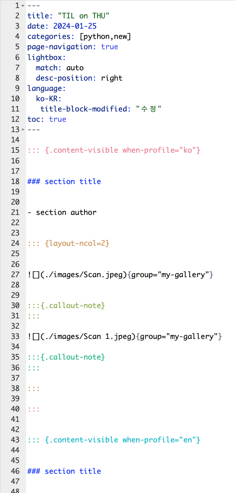

# TIL 업로드 자동화

## TIL

- "Today I Learned"의 약자로 오늘 배운 것을 간략하게 작성하는 것을 의미한다.

## TIL 업로드 자동화 동기

- 보통 필기로 공부를 많이 하기 때문에 필기 스캔본과 해당 스캔본의 키워드를 [블로그](https://oooo12.ooo/ko/til) TIL에 업로드 하고 있는 상황.
- 전날 TIL 양식을 복붙하면서 TIL을 작성하는데 시간이 상당히 오래 걸림 (😡 > 자동화!)

## input

R에서 `new_post_TIL(categories,numbers_of_images)` 두 개 인수 채워주기

### ex.

1. 오늘 배운 항목이 python,new
2. 필기본을 스캔한 이미지 파일이 2개 라면

`new_post_TIL(categories = "R,RPA,Quarto",numbers_of_images = 2)` 입력 엔터

### output details

다음 항목이 자동화를 통해 생성됨
=== 디렉토리 ===
1. TIL 폴더 내에 오늘 연월일(ex. 2024-01-25)로 된 폴더
2. 오늘 연월일로 된 폴더 내부의 images 폴더
3. index.qmd
=== qmd ===
4. `title`: TIL on "요일" -> 오늘 요일 할당
5. `date` : -> 오늘 날짜 할당
6. `page-navigation`, `lightbox`, `language`, `toc` 옵션
7. [Bilingual 블로그](https://oooo12.ooo/ko/blog/multilanguage-blog-with-quarto/)를 위한 [Quarto profile](https://quarto.org/docs/projects/profiles.html)\[ko, en\] 지정
8. `numbers_of_images`에 맞는 `` 생성 (``,``...)
9. 각 이미지 아래에 [콜아웃](https://quarto.org/docs/authoring/callouts.html) 영역 생성

## output

아래와 같이 categories가 입력되어 있고 Quarto blog에 사용되는 yaml option이 적용된 Template가 적용된 qmd 파일이 생성됨.

## Reference

https://themockup.blog/posts/2022-11-08-use-r-to-generate-a-quarto-blogpost/

위 블로그 내용을 기반으로 커스터마이징

### End of the document